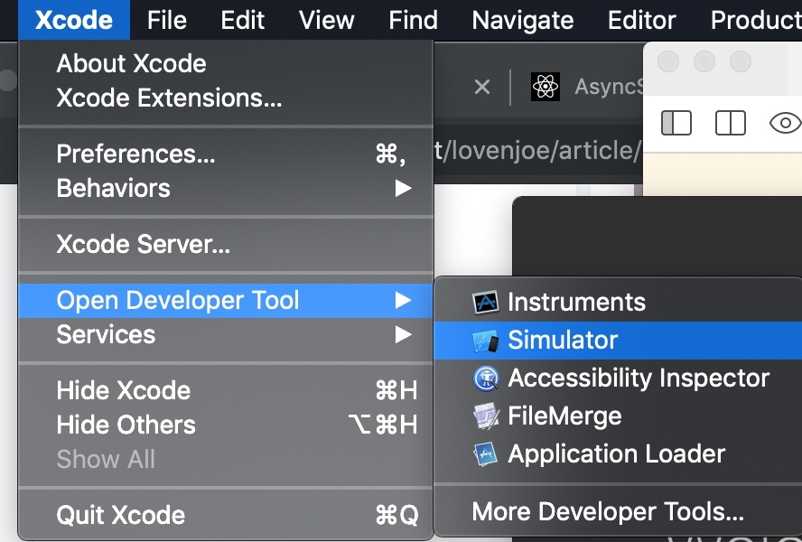
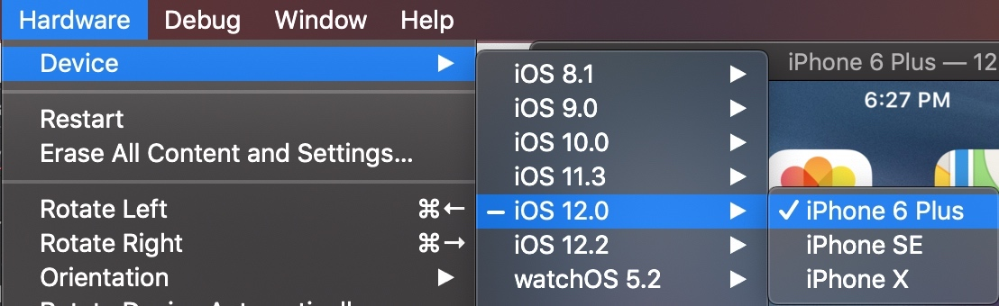
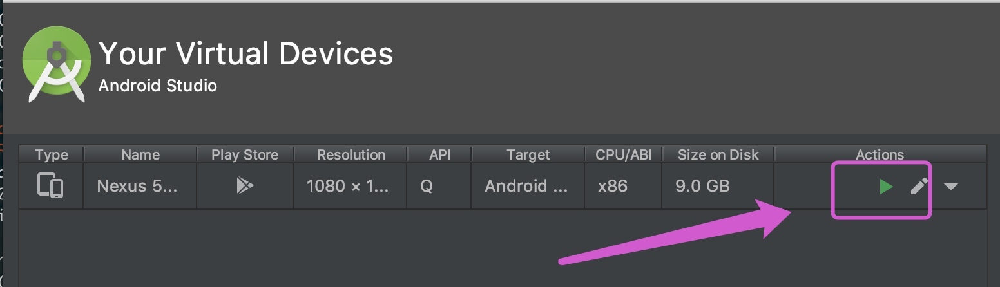

# 一、配置 flutter 环境

## 平台配置
安装 Android studio

遇到问题，参考：[掘金](https://juejin.im/post/5cd27211518825457b528186)

需要安装插件：
```
启动Android Studio。
打开插件首选项 (macOS：Preferences>Plugins, Windows：File>Settings>Plugins)。
选择 Browse repositories…，选择 flutter 插件并点击 install。
重启Android Studio后插件生效。
```

## 创建并运行一个简单的Flutter应用

1、先运行起来一个模拟器
iOS：`open -a Simulator` 或者 






点击`Android Studio`中的上方菜单`tool`->`AVD Manager`选项




2、创建一个flutter项目并运行
```
$ cd ~/Desktop
$ flutter create my_app
$ cd my_app
$ flutter run
```

